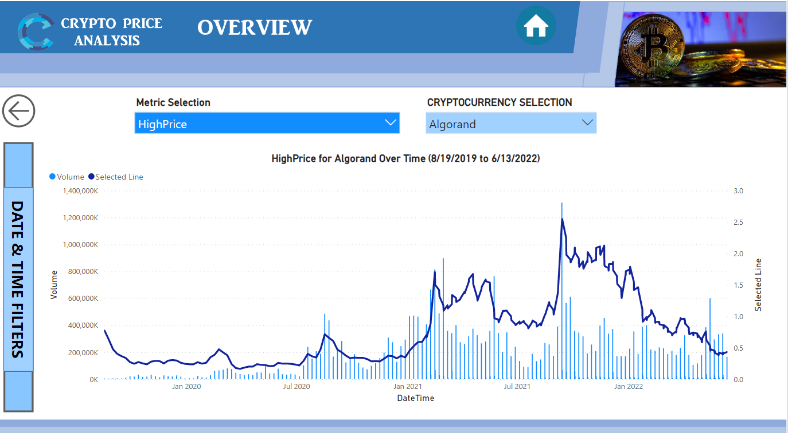
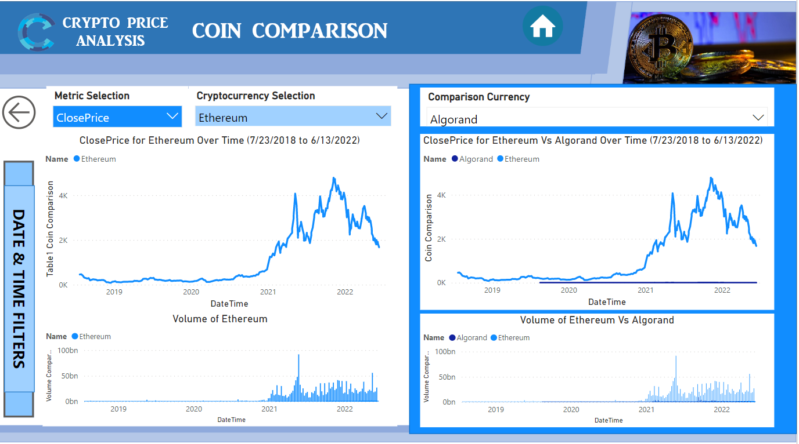
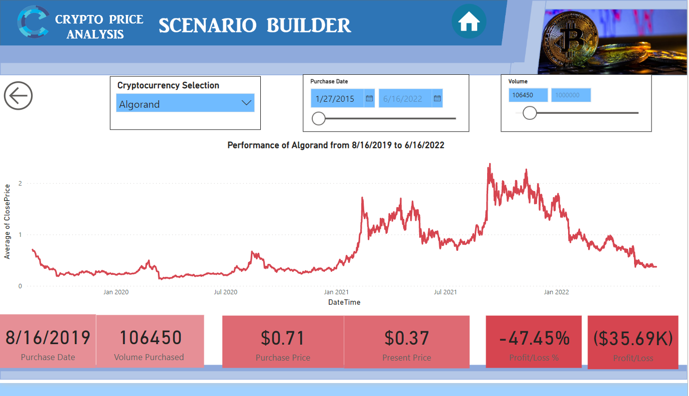

# **Cryptocurrency-Analysis-Dashboard**

## Access Interative Power BI dashboard [here](https://app.powerbi.com/view?r=eyJrIjoiZTVhNDMwMjYtOTRmNS00ZGQ2LTg0YzctYjE5YjYwMDAxNTk3IiwidCI6IjA4NDM5N2IzLTI1NWEtNGE5MC1hZDYyLTQyYmY1MmY2N2FhMCIsImMiOjF9&pageName=ReportSectionfef61ae5e9680a4a1ec0)

# Use Case

- Objective Statement:
  * Dynamic Cryptocurrency Analysis Dashboard using Power Bi and DAX language
  * To Analyze historical performance of 25 cryptocurrencies and their volume.
  * To compare price and volume of 2 user selected cryptocurrencies and thier volume.
  * Scenario builder, that let's you choose volume and purchase date of a coin and see the present value of that purchase

- Methodology / Analytic Technique:
  * Descriptive analysis
  * Time series analysis

- Business Benefit:
  * Helping Cryptocurrency investors to make better investments by analysis historical patterns and trends
  * Know how your investment would have progressed based on volume/price

- Expected Outcome:
  * Know trends and patterns of coins over the years
  * Know which coin to invest by comparing them side by side
  * Recommendation based previous investments and trends
  
# Business Understanding

- A cryptocurrency is a digital or virtual currency that is secured by cryptography, which makes it nearly impossible to counterfeit or double-spend.  Cryptocurrency is the revolution of this century. Every millennial who grew with the advancements of the internet, And its marvelous inventions knows a thing or two about cryptocurrencies : 
- How coin prices move over the years/month/weeks ?
- Which coin to buy ?
- Would a specific investment in the past be profitable or not?

# Data Understanding

- Historical Crypotocurrency data : 
- Source Data: Cryptowatch Api
https://docs.cryptowat.ch/rest-api/markets/ohlc
- The dataset has 7 columns and  300k+ rows for 25 cyprocurrency coins 
- CloseTime  
- OpenPrice   
- HighPrice
- LowPrice
- ClosePrice
- Volume
- QuoteVolume

# Data preparation 

- Platform Used : PowerBi (free version)
- Used powerbi "From Web" to get data into powerbi. 
- Used "Invoke custom function" to retrieve historical data of 25 coins 

# Overview Screen Features :
- Dynamically select open price, close price, high price and low price
- Used a combination chart of bar and line charts to visualize volume and price 
- Date and Time Filters allows you to select a specific time frame or day of the week, month ans year to make analysis accurate

# Coin Comparison Screen:
- Select Coin 1 and Coin 2, Compare the price trends and volume
- Used multiple line charts to compare price and bar chart to compare volume
- Dynamically select open price, close price, high price and low price
- Date and Time Filters allows you to select a specific time frame for analysis

# Scenario Builder Screen
- Select coin, volume and date
- Analyze the current price, profit/loss of your investments 

